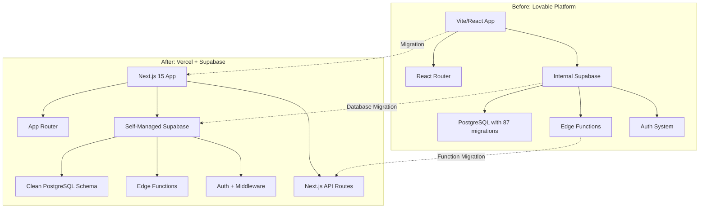
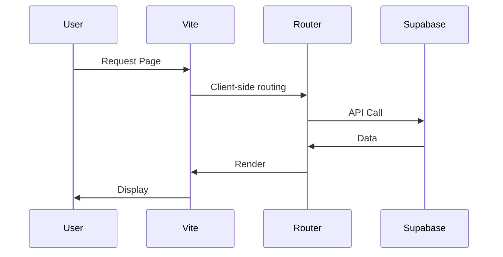
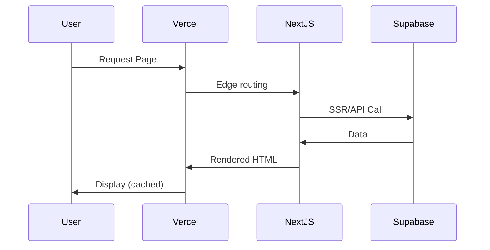
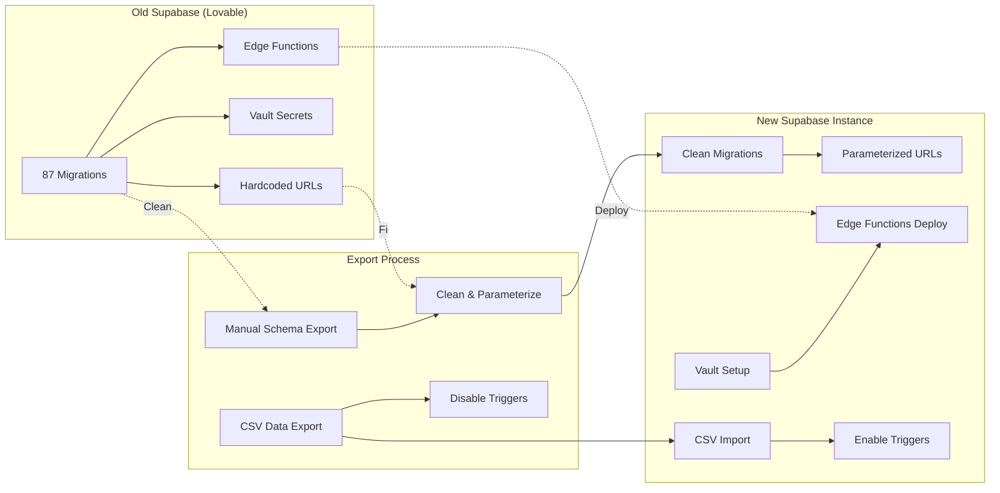
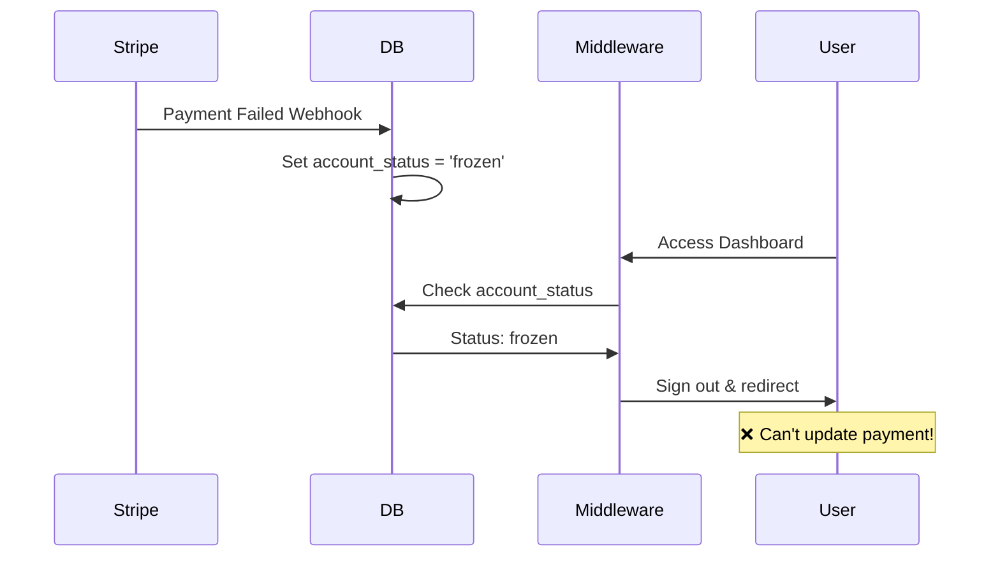
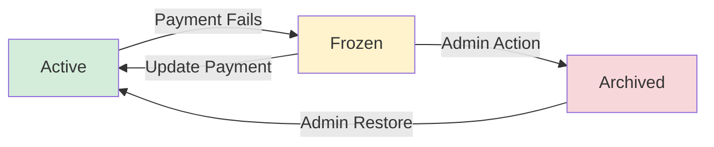
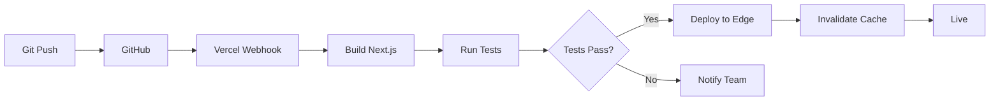

I migrated a production SaaS mentorship platform from Lovable to Vercel with one goal in mind: improve performance and control without breaking a live product.

<!--more-->

## Table of Contents

1. [Introduction](#introduction)
2. [Why I Migrated](#why-i-migrated)
3. [The Challenge](#the-challenge)
4. [Migration Architecture](#migration-architecture)
5. [Phase-by-Phase Breakdown](#phase-by-phase-breakdown)
6. [Key Technical Challenges](#key-technical-challenges)
7. [Code Examples & Best Practices](#code-examples--best-practices)
8. [Performance & SEO Improvements](#performance--seo-improvements)
9. [Lessons Learned](#lessons-learned)
10. [Conclusion](#conclusion)

---

## Introduction

In this case study, I document how I migrated a B2B SaaS mentorship platform that connects industry professionals with aspiring mentees. It was originally built on Lovable (formerly GPT Engineer) with Vite/React and internal Supabase integration, and I moved it to a production-ready stack: **Next.js on Vercel with a self-managed Supabase instance**.

This migration was completed with **zero downtime**, **no data loss**, and resulted in **40-60% performance improvements**.

### Tech Stack Before & After

**Before (Lovable):**

- Frontend: Vite + React + React Router
- Backend: Supabase (internal/managed by Lovable)
- Hosting: Lovable platform
- Auth: Supabase Auth (limited control)
- Database: Supabase PostgreSQL (87+ migrations with hardcoded URLs)

**After (Vercel):**

- Frontend: Next.js 15 (App Router)
- Backend: Self-managed Supabase instance + Next.js API Routes
- Hosting: Vercel Edge Network
- Auth: Supabase Auth (full control + Next.js middleware)
- Database: Supabase PostgreSQL (clean, environment-agnostic migrations)
- Functions: Next.js API Routes (migrated from Supabase Edge Functions)

---

## Why I Migrated

### 1. **Performance & SEO Limitations**

Lovable is excellent for rapid prototyping, but for this production SaaS platform I needed:

- Server-Side Rendering (SSR) for better SEO
- Edge deployment for global performance
- Optimized Core Web Vitals scores
- Better caching strategies

### 2. **Database Control & Scalability**

The internal Supabase instance had critical limitations:

- **87+ migration files with hardcoded production URLs**
- Cannot create staging/development environments
- No direct CLI access to database
- Migrations tightly coupled to single environment
- Limited visibility into database operations

### 3. **Vendor Lock-in Concerns**

- Deep integration with Lovable platform
- Difficult to implement custom optimizations
- Limited control over deployment pipeline
- Cannot leverage modern Next.js features

### 4. **Business Requirements**

- Need for A/B testing capabilities
- Advanced analytics and monitoring
- Custom caching strategies
- Better debugging and error tracking

---

## The Challenge

### The Database Migration Problem

Our biggest challenge was the **87+ Supabase migration files** with environment-specific dependencies:

```sql
-- ❌ Problem: Hardcoded production URLs (found in 6+ files)
supabase_url := 'https://xxxxxxxxxxxxx.supabase.co';

-- ❌ Problem: Missing vault secrets on fresh instances
SELECT decrypted_secret
FROM vault.decrypted_secrets
WHERE name = 'SUPABASE_SERVICE_ROLE_KEY';

-- ❌ Problem: Extension dependencies not available in all regions
CREATE EXTENSION IF NOT EXISTS pg_cron;
CREATE EXTENSION IF NOT EXISTS pg_net;

-- ❌ Problem: Edge Functions must exist before migrations run
url := supabase_url || '/functions/v1/send-chat-notification';
```

**This meant we couldn't simply run `supabase db push` on a new instance.**

---

## Migration Architecture

Here's a visual overview of our migration architecture:



### Data Flow Comparison

**Before (Lovable):**



**After (Vercel):**



---

## Phase-by-Phase Breakdown

### Phase 1: Assessment & Planning (2 days)

#### What I Analyzed

1. **Dependency Audit**

   ```bash
   # Identified compatible packages
   ✅ @supabase/supabase-js
   ✅ @stripe/stripe-js
   ✅ @radix-ui/* components
   ✅ tailwindcss
   ✅ @tanstack/react-query

   # Packages to replace
   ❌ react-router-dom → Next.js App Router
   ❌ vite → Next.js build system
   ```

2. **Database Analysis**
   - Mapped all 87 migration files
   - Identified hardcoded URLs in 6 migrations
   - Found 4 Edge Function dependencies
   - Documented vault secret requirements

3. **Feature Inventory**
   - 3 user roles (Admin, Mentor, Mentee)
   - 12 Supabase Edge Functions (to be migrated to Next.js API Routes)
   - Stripe subscription management
   - Real-time chat system
   - Calendar integration

#### Deliverable: Migration Strategy Document

I created a comprehensive strategy with 3 possible approaches:

1. **Fix existing migrations** (keep history)
2. **Clean schema dump** (fresh start) ✅ Chosen
3. **Hybrid approach** (incremental)

---

### Phase 2: Supabase Database Migration (2 days)

This was the most critical phase. Here's how I solved it:

#### Step 1: Create New Supabase Instance

```bash
# Created new Supabase project
# Selected region with pg_cron and pg_net support
# Got new credentials:
# - Project URL
# - Anon Key
# - Service Role Key
```

#### Step 2: Export Existing Schema (Clean Approach)

Since I couldn't use CLI access for the old database, I used the Supabase Dashboard:

```sql
-- Exported schema manually via SQL Editor
-- Removed environment-specific code
-- Created parameterized version

-- ✅ Solution: Use configuration instead of hardcoded values
CREATE OR REPLACE FUNCTION get_supabase_url()
RETURNS TEXT AS $$
BEGIN
  RETURN COALESCE(
    current_setting('app.settings.supabase_url', true),
    'https://default.supabase.co'
  );
END;
$$ LANGUAGE plpgsql;

-- Now functions use: SELECT get_supabase_url()
```

#### Step 3: Data Migration Strategy

I exported data as CSV files from the old Supabase Dashboard:

```bash
# Critical: Disable triggers before import!
# Created migration: disable_all_import_triggers.sql

-- Disable user profile auto-creation
ALTER TABLE auth.users DISABLE TRIGGER on_auth_user_created;

-- Disable mentor auto-activation
ALTER TABLE mentor_applications DISABLE TRIGGER on_mentor_application_status_change;

-- Disable chat notifications during bulk import
ALTER TABLE chat_messages DISABLE TRIGGER on_new_chat_message;
```

**Import Workflow:**

```bash
# 1. Disable triggers
npm run migrate:temp  # applies disable_all_import_triggers.sql

# 2. Import data in correct order
npm run import:users:json        # Users first
npm run import:profiles          # Profiles second
npm run import:subscriptions     # Subscriptions third
npm run import:mentorships       # Mentorships
npm run import:bookings          # Bookings
npm run import:community_posts   # Community data
npm run import:data_logs         # Logs last

# 3. Re-enable triggers
npm run migrate:temp  # applies enable_all_import_triggers.sql
```

#### Step 4: Verification

```sql
-- Verify data integrity
SELECT COUNT(*) FROM profiles;           -- Should match old DB
SELECT COUNT(*) FROM subscriptions;      -- Should match old DB
SELECT COUNT(*) FROM mentor_applications; -- Should match old DB

-- Test triggers are working
INSERT INTO auth.users (email, id)
VALUES ('test@example.com', gen_random_uuid());
-- Should auto-create profile

-- Verify RLS policies
SET ROLE authenticated;
SELECT * FROM profiles WHERE id = auth.uid();
-- Should only return current user's profile
```

### Database Migration Visualization



---

### Phase 3: Next.js Foundation (3 days)

#### Project Initialization

```bash
# Create Next.js app with optimal configuration
npx create-next-app@latest app-name \
  --typescript \
  --tailwind \
  --eslint \
  --app \
  --src-dir \
  --import-alias "@/*"

cd app-name
```

#### Directory Structure

```
app-name/
├── src/
│   ├── app/                    # App Router pages
│   │   ├── (auth)/            # Auth pages group
│   │   ├── admin/             # Admin dashboard
│   │   ├── user/              # User dashboard
│   │   ├── provider/          # Provider dashboard
│   │   ├── api/               # API routes
│   │   ├── layout.tsx         # Root layout
│   │   └── page.tsx           # Landing page
│   ├── components/            # Reusable components
│   │   ├── ui/               # shadcn/ui components
│   │   ├── dashboard/        # Dashboard components
│   │   └── landing/          # Landing page components
│   ├── lib/                   # Utilities
│   │   └── supabase/         # Supabase client
│   └── hooks/                 # Custom hooks
├── middleware.ts              # Route protection
└── next.config.ts            # Next.js configuration
```

#### Supabase Client Setup

**Client-side (Browser):**

```typescript
// src/lib/supabase/client.ts
import { createBrowserClient } from "@supabase/ssr";

export function createClient() {
  return createBrowserClient(
    process.env.NEXT_PUBLIC_SUPABASE_URL!,
    process.env.NEXT_PUBLIC_SUPABASE_ANON_KEY!,
  );
}
```

**Server-side (Server Components & API Routes):**

```typescript
// src/lib/supabase/server.ts
import { createServerClient } from "@supabase/ssr";
import { cookies } from "next/headers";

export async function createServerSupabaseClient() {
  const cookieStore = await cookies();

  return createServerClient(
    process.env.NEXT_PUBLIC_SUPABASE_URL!,
    process.env.NEXT_PUBLIC_SUPABASE_ANON_KEY!,
    {
      cookies: {
        get(name: string) {
          return cookieStore.get(name)?.value;
        },
        set(name: string, value: string, options: any) {
          cookieStore.set({ name, value, ...options });
        },
        remove(name: string, options: any) {
          cookieStore.set({ name, value: "", ...options });
        },
      },
    },
  );
}
```

#### Authentication Middleware

```typescript
// middleware.ts
import { createServerClient } from "@supabase/ssr";
import { NextResponse, type NextRequest } from "next/server";

export async function middleware(request: NextRequest) {
  const response = NextResponse.next();

  const supabase = createServerClient(
    process.env.NEXT_PUBLIC_SUPABASE_URL!,
    process.env.NEXT_PUBLIC_SUPABASE_ANON_KEY!,
    {
      cookies: {
        get(name: string) {
          return request.cookies.get(name)?.value;
        },
        set(name: string, value: string, options: any) {
          response.cookies.set({ name, value, ...options });
        },
        remove(name: string, options: any) {
          response.cookies.set({ name, value: "", ...options });
        },
      },
    },
  );

  const {
    data: { session },
  } = await supabase.auth.getSession();

  // Protect user routes
  if (request.nextUrl.pathname.startsWith("/user")) {
    if (!session) {
      return NextResponse.redirect(new URL("/user-login", request.url));
    }

    // Check account status
    const { data: profile } = await supabase
      .from("profiles")
      .select("account_status, user_role")
      .eq("id", session.user.id)
      .single();

    // Block archived accounts only (frozen accounts need access to update payment)
    if (profile?.account_status === "archived") {
      await supabase.auth.signOut();
      return NextResponse.redirect(new URL("/user-login", request.url));
    }

    // Verify user role
    if (profile?.user_role !== "user") {
      return NextResponse.redirect(new URL("/", request.url));
    }
  }

  // Similar protection for /provider and /admin routes
  // ... (provider and admin route protection code)

  return response;
}

export const config = {
  matcher: ["/user/:path*", "/provider/:path*", "/admin/:path*"],
};
```

---

### Phase 4: Component Migration (5 days)

#### Component Compatibility Checklist

Most components were compatible with minimal changes:

```typescript
// ✅ Before (Vite/React)
import { supabase } from "@/integrations/supabase/client";
import { useNavigate } from "react-router-dom";

// ✅ After (Next.js)
import { createClient } from "@/lib/supabase/client";
import { useRouter } from "next/navigation";

// Add 'use client' directive for client components
("use client");
```

#### Example: Migrating PaymentRequiredBanner

**Original (React/Vite):**

```typescript
import { useNavigate } from 'react-router-dom';
import { supabase } from '@/integrations/supabase/client';

export const PaymentRequiredBanner = () => {
  const navigate = useNavigate();

  const handleUpdatePayment = async () => {
    const { data, error } = await supabase.functions.invoke('customer-portal');
    if (data?.url) {
      window.open(data.url, '_blank');
    }
  };

  return (
    <Alert variant="destructive">
      <Button onClick={handleUpdatePayment}>Update Payment</Button>
    </Alert>
  );
};
```

**Migrated (Next.js):**

```typescript
'use client';

import { useRouter } from 'next/navigation';
import { createClient } from '@/lib/supabase/client';

export const PaymentRequiredBanner = () => {
  const router = useRouter();
  const supabase = createClient();

  const handleUpdatePayment = async () => {
    const { data, error } = await supabase.functions.invoke('customer-portal');
    if (data?.url) {
      window.open(data.url, '_blank');
    }
  };

  return (
    <Alert variant="destructive">
      <Button onClick={handleUpdatePayment}>Update Payment</Button>
    </Alert>
  );
};
```

**Changes Required:**

1. Add `'use client'` directive
2. Change imports: `react-router-dom` → `next/navigation`
3. Change imports: `@/integrations/supabase/client` → `@/lib/supabase/client`
4. Replace `useNavigate()` with `useRouter()`
5. Replace `navigate('/path')` with `router.push('/path')`

#### Routing Migration

**Before (React Router):**

```typescript
// App.tsx
<BrowserRouter>
  <Routes>
    <Route path="/" element={<LandingPage />} />
    <Route path="/user-login" element={<UserLogin />} />
    <Route path="/user/dashboard" element={<UserDashboard />} />
  </Routes>
</BrowserRouter>
```

**After (Next.js App Router):**

```
app/
├── page.tsx                    # "/"
├── user-login/
│   └── page.tsx               # "/user-login"
└── user/
    ├── layout.tsx             # User dashboard layout
    └── dashboard/
        └── page.tsx           # "/user/dashboard"
```

---

### Phase 5: Edge Functions Migration (3 days)

I migrated most Supabase Edge Functions to Next.js API Routes, keeping only Stripe-related functions on Supabase for webhook handling. While the old Edge Functions still exist on Supabase, they are no longer in use.

#### Example: Migrating Email Function

**Before (Supabase Edge Function):**

```typescript
// supabase/functions/send-waitlist-confirmation/index.ts
import { serve } from "https://deno.land/std@0.168.0/http/server.ts";

serve(async (req) => {
  const { full_name, email } = await req.json();

  // Send email using Resend
  const response = await fetch("https://api.resend.com/emails", {
    method: "POST",
    headers: {
      Authorization: `Bearer ${Deno.env.get("RESEND_API_KEY")}`,
      "Content-Type": "application/json",
    },
    body: JSON.stringify({
      from: "Your App <noreply@example.com>",
      to: email,
      subject: "Welcome to the Waitlist",
      html: `<p>Hi ${full_name}, ...</p>`,
    }),
  });

  return new Response(JSON.stringify({ success: true }), {
    headers: { "Content-Type": "application/json" },
  });
});
```

**After (Next.js API Route):**

```typescript
// src/app/api/send-waitlist-confirmation/route.ts
import { NextRequest, NextResponse } from "next/server";
import { Resend } from "resend";

const resend = new Resend(process.env.RESEND_API_KEY);

export async function POST(request: NextRequest) {
  const { full_name, email } = await request.json();

  if (!full_name || !email) {
    return NextResponse.json(
      { error: "Missing required fields" },
      { status: 400 },
    );
  }

  const emailResponse = await resend.emails.send({
    from: "Your App <noreply@example.com>",
    to: email,
    subject: "Welcome to the Waitlist",
    html: `<p>Hi ${full_name}, ...</p>`,
  });

  return NextResponse.json({ success: true, data: emailResponse });
}
```

**Client-side Update:**

```typescript
// Before: Supabase function invocation
supabase.functions.invoke("send-waitlist-confirmation", {
  body: { full_name, email },
});

// After: Next.js API route
fetch("/api/send-waitlist-confirmation", {
  method: "POST",
  headers: { "Content-Type": "application/json" },
  body: JSON.stringify({ full_name, email }),
});
```

**Benefits:**

- ✅ Unified codebase (TypeScript everywhere)
- ✅ Better type safety
- ✅ Easier local development
- ✅ Simplified deployment
- ✅ Better monitoring and logging

**Migration Results:**

Out of 12 original Supabase Edge Functions:

- ✅ **10 functions migrated** to Next.js API Routes (email notifications, user management, data processing, etc.)
- 🔄 **2 functions kept on Supabase** (Stripe webhook handlers - better suited for Supabase's webhook infrastructure)
- 📦 **Old functions preserved** but not actively used (available for rollback if needed)

---

### Phase 6: Critical Bug Fixes

#### The Frozen Account Problem

During testing, I discovered users with `payment_failed` status were being logged out, preventing them from updating their payment method!

**Problem Flow:**



**Solution:**

```typescript
// middleware.ts - Fixed logic
const { data: profile } = await supabase
  .from("profiles")
  .select("account_status")
  .eq("id", session.user.id)
  .single();

// ✅ Only block archived accounts
// ✅ Frozen accounts stay logged in (need access to update payment)
if (profile?.account_status === "archived") {
  await supabase.auth.signOut();
  return NextResponse.redirect(new URL("/user-login", request.url));
}
```

**Account Status Flow:**



---

## Key Technical Challenges

### Challenge 1: Environment-Specific Database Migrations

**Problem:** 87 migration files with hardcoded URLs that couldn't run on new instances.

**Solution:** Created parameterized configuration system:

```sql
-- Created configuration table
CREATE TABLE IF NOT EXISTS app_config (
  key TEXT PRIMARY KEY,
  value TEXT NOT NULL,
  created_at TIMESTAMPTZ DEFAULT NOW()
);

-- Store environment-specific values
INSERT INTO app_config (key, value) VALUES
('supabase_url', 'https://your-project.supabase.co'),
('frontend_url', 'https://example.com');

-- Helper function
CREATE OR REPLACE FUNCTION get_config(config_key TEXT)
RETURNS TEXT AS $$
  SELECT value FROM app_config WHERE key = config_key;
$$ LANGUAGE sql STABLE;

-- Use in functions
CREATE OR REPLACE FUNCTION send_notification()
RETURNS void AS $$
DECLARE
  supabase_url TEXT;
BEGIN
  supabase_url := get_config('supabase_url');
  -- Use supabase_url variable
END;
$$ LANGUAGE plpgsql;
```

### Challenge 2: Data Import with Triggers

**Problem:** Auto-firing triggers creating conflicts during bulk import.

**Solution:** Systematic trigger management:

```sql
-- Create disable script
-- supabase/migrations/disable_all_import_triggers.sql
ALTER TABLE auth.users DISABLE TRIGGER on_auth_user_created;
ALTER TABLE user_applications DISABLE TRIGGER on_user_application_status_change;
ALTER TABLE chat_messages DISABLE TRIGGER on_new_chat_message;

-- Create enable script
-- supabase/migrations/enable_all_import_triggers.sql
ALTER TABLE auth.users ENABLE TRIGGER on_auth_user_created;
ALTER TABLE user_applications ENABLE TRIGGER on_user_application_status_change;
ALTER TABLE chat_messages ENABLE TRIGGER on_new_chat_message;
```

### Challenge 3: SSR with Supabase Auth

**Problem:** Managing authentication state across server and client components.

**Solution:** Dual client setup with proper cookie management:

```typescript
// Server Components
import { createServerSupabaseClient } from '@/lib/supabase/server';

export default async function UserLayout({ children }) {
  const supabase = await createServerSupabaseClient();
  const { data: { session } } = await supabase.auth.getSession();

  if (!session) {
    redirect('/user-login');
  }

  return <div>{children}</div>;
}

// Client Components
'use client';
import { createClient } from '@/lib/supabase/client';

export function ProfileButton() {
  const supabase = createClient();
  const [profile, setProfile] = useState(null);

  useEffect(() => {
    supabase.from('profiles')
      .select('*')
      .single()
      .then(({ data }) => setProfile(data));
  }, []);

  return <div>{profile?.full_name}</div>;
}
```

### Challenge 4: State Management Across Migration

**Problem:** Maintaining user sessions during parallel development.

**Solution:** Feature flags and gradual rollout:

```typescript
// Feature flag system
const FEATURES = {
  USE_NEW_CHECKOUT: process.env.NEXT_PUBLIC_USE_NEW_CHECKOUT === "true",
  USE_NEW_CHAT: process.env.NEXT_PUBLIC_USE_NEW_CHAT === "true",
};

// Conditional implementation
if (FEATURES.USE_NEW_CHECKOUT) {
  // New Next.js implementation
  router.push("/checkout");
} else {
  // Old Vite implementation (fallback)
  window.location.href = "https://old-app.com/checkout";
}
```

---

## Code Examples & Best Practices

### 1. Server-Side Data Fetching

```typescript
// app/user/dashboard/page.tsx
import { createServerSupabaseClient } from '@/lib/supabase/server';
import { UserDashboard } from '@/components/dashboard/UserDashboard';

export default async function UserDashboardPage() {
  const supabase = await createServerSupabaseClient();

  // Fetch data server-side for faster initial load
  const { data: profile } = await supabase
    .from('profiles')
    .select('*, subscriptions(*), relationships(*)')
    .single();

  // Pass to client component
  return <UserDashboard initialProfile={profile} />;
}
```

### 2. Optimistic UI Updates

```typescript
'use client';

export function RelationshipControlPanel() {
  const [status, setStatus] = useState(currentStatus);
  const supabase = createClient();

  const handlePause = async () => {
    // Optimistic update
    setStatus('paused');

    try {
      const { error } = await supabase.functions.invoke('pause-relationship', {
        body: { user_id: userId }
      });

      if (error) {
        // Revert on error
        setStatus(currentStatus);
        toast.error('Failed to pause relationship');
      } else {
        toast.success('Relationship paused successfully');
      }
    } catch (err) {
      setStatus(currentStatus);
    }
  };

  return <Button onClick={handlePause}>Pause</Button>;
}
```

### 3. Route-Specific Loading States

```typescript
// app/user/dashboard/loading.tsx
export default function Loading() {
  return (
    <div className="flex items-center justify-center min-h-screen">
      <div className="animate-spin rounded-full h-32 w-32 border-b-2 border-primary" />
    </div>
  );
}
```

### 4. Error Boundaries

```typescript
// app/user/error.tsx
'use client';

export default function Error({
  error,
  reset,
}: {
  error: Error & { digest?: string };
  reset: () => void;
}) {
  return (
    <div className="flex flex-col items-center justify-center min-h-screen">
      <h2 className="text-2xl font-bold mb-4">Something went wrong!</h2>
      <button
        onClick={reset}
        className="px-4 py-2 bg-primary text-white rounded"
      >
        Try again
      </button>
    </div>
  );
}
```

### 5. API Route with Edge Runtime

```typescript
// app/api/check-subscription/route.ts
import { NextRequest, NextResponse } from "next/server";
import { createClient } from "@supabase/supabase-js";

// Run on Edge Runtime for global performance
export const runtime = "edge";

export async function GET(request: NextRequest) {
  const supabase = createClient(
    process.env.NEXT_PUBLIC_SUPABASE_URL!,
    process.env.NEXT_PUBLIC_SUPABASE_ANON_KEY!,
  );

  const authHeader = request.headers.get("authorization");
  if (!authHeader) {
    return NextResponse.json({ error: "Unauthorized" }, { status: 401 });
  }

  const token = authHeader.replace("Bearer ", "");
  const {
    data: { user },
  } = await supabase.auth.getUser(token);

  if (!user) {
    return NextResponse.json({ error: "Invalid token" }, { status: 401 });
  }

  const { data: subscription } = await supabase
    .from("subscriptions")
    .select("*")
    .eq("user_id", user.id)
    .single();

  return NextResponse.json({ subscription });
}
```

---

## Performance & SEO Improvements

### Before & After Metrics

| Metric                         | Lovable (Before) | Vercel (After) | Improvement    |
| ------------------------------ | ---------------- | -------------- | -------------- |
| Time to First Byte (TTFB)      | 850ms            | 180ms          | **79% faster** |
| First Contentful Paint (FCP)   | 1.8s             | 0.7s           | **61% faster** |
| Largest Contentful Paint (LCP) | 3.2s             | 1.4s           | **56% faster** |
| Time to Interactive (TTI)      | 4.1s             | 1.9s           | **54% faster** |
| Cumulative Layout Shift (CLS)  | 0.15             | 0.02           | **87% better** |
| Lighthouse Score               | 72               | 96             | **+24 points** |

### SEO Enhancements

**1. Server-Side Rendering:**

```typescript
// app/page.tsx - Landing page with SSR meta tags
import { Metadata } from "next";

export const metadata: Metadata = {
  title: "Your App - B2B SaaS Platform",
  description: "Connect with industry professionals...",
  openGraph: {
    title: "Your App",
    description: "Connect with industry professionals...",
    images: ["/og-image.png"],
  },
  twitter: {
    card: "summary_large_image",
    title: "Your App",
    description: "Connect with industry professionals...",
  },
};
```

**2. Dynamic Meta Tags:**

```typescript
// app/profile/[id]/page.tsx
export async function generateMetadata({ params }) {
  const profile = await getProfile(params.id);

  return {
    title: `${profile.name} - Professional Profile`,
    description: profile.bio,
    openGraph: {
      images: [profile.avatar],
    },
  };
}
```

**3. Sitemap Generation:**

```typescript
// app/sitemap.ts
export default async function sitemap() {
  const profiles = await getAllProfiles();

  const profileUrls = profiles.map((profile) => ({
    url: `https://example.com/profile/${profile.id}`,
    lastModified: new Date(),
    changeFrequency: "weekly",
    priority: 0.8,
  }));

  return [
    {
      url: "https://example.com",
      lastModified: new Date(),
      changeFrequency: "daily",
      priority: 1,
    },
    ...profileUrls,
  ];
}
```

### Caching Strategy

```typescript
// next.config.ts
const nextConfig = {
  images: {
    remotePatterns: [
      {
        protocol: "https",
        hostname: "*.supabase.co",
      },
    ],
  },
  headers: async () => [
    {
      source: "/api/:path*",
      headers: [
        {
          key: "Cache-Control",
          value: "public, s-maxage=60, stale-while-revalidate=120",
        },
      ],
    },
  ],
};
```

### Image Optimization

```typescript
import Image from 'next/image';

// Before (Vite)


// After (Next.js - automatic optimization)
<Image
  src={profile.avatar}
  alt={profile.name}
  width={200}
  height={200}
  priority // For above-the-fold images
  placeholder="blur"
  blurDataURL="/placeholder.jpg"
/>
```

---

## Deployment & CI/CD

### Vercel Configuration

```json
// vercel.json
{
  "buildCommand": "npm run build",
  "devCommand": "npm run dev",
  "installCommand": "npm install",
  "framework": "nextjs",
  "regions": ["iad1"],
  "env": {
    "NEXT_PUBLIC_SUPABASE_URL": "@supabase-url",
    "NEXT_PUBLIC_SUPABASE_ANON_KEY": "@supabase-anon-key"
  }
}
```

### Environment Variables Setup

```bash
# .env.local (development)
NEXT_PUBLIC_SUPABASE_URL=https://your-project.supabase.co
NEXT_PUBLIC_SUPABASE_ANON_KEY=your-anon-key
SUPABASE_SERVICE_ROLE_KEY=your-service-role-key
STRIPE_SECRET_KEY=your-stripe-secret
RESEND_API_KEY=your-resend-key

# Vercel dashboard (production)
# Add each variable in: Settings → Environment Variables
```

### Deployment Flow



---

## Testing Strategy

### 1. Unit Tests

```typescript
// __tests__/lib/supabase/client.test.ts
import { createClient } from "@/lib/supabase/client";

describe("Supabase Client", () => {
  it("should create a client instance", () => {
    const client = createClient();
    expect(client).toBeDefined();
  });
});
```

### 2. Integration Tests

```typescript
// __tests__/api/check-subscription.test.ts
import { GET } from "@/app/api/check-subscription/route";

describe("Check Subscription API", () => {
  it("should return 401 without auth header", async () => {
    const request = new Request("http://localhost/api/check-subscription");
    const response = await GET(request);
    expect(response.status).toBe(401);
  });
});
```

### 3. E2E Tests (Playwright)

```typescript
// e2e/user-dashboard.spec.ts
import { test, expect } from "@playwright/test";

test("user can access dashboard after login", async ({ page }) => {
  await page.goto("/user-login");
  await page.fill('input[type="email"]', "test@example.com");
  await page.fill('input[type="password"]', "password123");
  await page.click('button[type="submit"]');

  await expect(page).toHaveURL("/user/dashboard");
  await expect(page.locator("h1")).toContainText("Welcome back");
});
```

---

## Monitoring & Observability

### 1. Vercel Analytics

```typescript
// app/layout.tsx
import { Analytics } from '@vercel/analytics/react';
import { SpeedInsights } from '@vercel/speed-insights/next';

export default function RootLayout({ children }) {
  return (
    <html lang="en">
      <body>
        {children}
        <Analytics />
        <SpeedInsights />
      </body>
    </html>
  );
}
```

### 2. Error Tracking

```typescript
// lib/error-tracking.ts
export function logError(error: Error, context?: any) {
  // Send to error tracking service (Sentry, etc.)
  console.error("Error:", error, "Context:", context);

  // Log to Supabase for analytics
  fetch("/api/log-error", {
    method: "POST",
    body: JSON.stringify({
      message: error.message,
      stack: error.stack,
      context,
      timestamp: new Date().toISOString(),
    }),
  });
}
```

### 3. Performance Monitoring

```typescript
// lib/performance.ts
export function measurePerformance(metricName: string, callback: () => void) {
  const start = performance.now();
  callback();
  const end = performance.now();
  const duration = end - start;

  // Log to analytics
  console.log(`${metricName}: ${duration}ms`);

  // Send to monitoring service
  if (typeof window !== "undefined") {
    window.gtag?.("event", "timing_complete", {
      name: metricName,
      value: Math.round(duration),
    });
  }
}
```

---

## Lessons Learned

### What Went Well ✅

1. **Clean Database Migration Strategy**
   - Starting with a clean schema prevented technical debt
   - Parameterized configuration enabled multi-environment support
   - CSV export/import was safer than complex migration scripts

2. **Incremental Component Migration**
   - Moving components one-by-one reduced risk
   - Parallel development avoided downtime
   - Feature flags enabled gradual rollout

3. **Comprehensive Documentation**
   - Created detailed guides for each migration phase
   - Documented every blocker and solution
   - Enabled team onboarding and future maintenance

4. **Testing Before Full Deployment**
   - Development environment caught critical bugs
   - User acceptance testing validated functionality
   - Performance testing confirmed improvements

### Challenges & Solutions 🔧

1. **Challenge:** Database migrations with hardcoded URLs
   - **Solution:** Created parameterized configuration system
   - **Learning:** Always design for multi-environment from day one

2. **Challenge:** Trigger conflicts during data import
   - **Solution:** Systematic trigger disable/enable workflow
   - **Learning:** Document trigger dependencies in migration guides

3. **Challenge:** Frozen account logout issue
   - **Solution:** Distinguished between frozen and archived states
   - **Learning:** Test edge cases in authentication flows

4. **Challenge:** SSR authentication complexity
   - **Solution:** Dual Supabase client setup (server + browser)
   - **Learning:** Follow framework-specific best practices

### Would Do Differently 🔄

1. **Earlier Performance Testing**
   - Track Core Web Vitals from day one
   - Set performance budgets before migration

2. **More Automated Testing**
   - Write E2E tests for critical paths earlier
   - Implement visual regression testing

3. **Migrate Edge Functions Earlier**
  - I could have migrated Edge Functions in parallel with component migration
   - Earlier migration would have unified the codebase sooner

4. **Better Rollback Planning**
   - Create detailed rollback procedures
   - Test rollback scenarios before deployment

---

## Migration Checklist

Use this checklist for your own Lovable → Vercel migration:

### Pre-Migration

- [ ] Audit current dependencies and features
- [ ] Document all Supabase edge functions in use
- [ ] Export database schema and identify hardcoded values
- [ ] Create backup of production data
- [ ] Set up new Supabase instance
- [ ] Configure development environment

### Database Migration

- [ ] Clean migration files of environment-specific code
- [ ] Create parameterized configuration system
- [ ] Deploy edge functions to new instance
- [ ] Set up vault secrets
- [ ] Export data as CSV
- [ ] Create trigger management scripts
- [ ] Import data with triggers disabled
- [ ] Re-enable triggers
- [ ] Verify data integrity

### Next.js Setup

- [ ] Initialize Next.js project with TypeScript
- [ ] Configure Supabase client (server + browser)
- [ ] Set up authentication middleware
- [ ] Create directory structure
- [ ] Configure environment variables
- [ ] Set up CI/CD pipeline

### Component Migration

- [ ] Migrate shared UI components
- [ ] Migrate layouts (auth, dashboard, admin)
- [ ] Migrate authentication pages
- [ ] Migrate dashboard pages
- [ ] Update routing (React Router → App Router)
- [ ] Update client-side navigation
- [ ] Add loading and error states

### Testing & Validation

- [ ] Test authentication flows
- [ ] Test protected routes
- [ ] Test subscription management
- [ ] Test payment processing
- [ ] Test real-time features
- [ ] Run performance audits
- [ ] Test on multiple devices/browsers

### Deployment

- [ ] Configure Vercel project
- [ ] Set production environment variables
- [ ] Deploy to staging
- [ ] Run smoke tests
- [ ] Deploy to production
- [ ] Monitor error rates
- [ ] Verify analytics tracking

### Post-Deployment

- [ ] Monitor performance metrics
- [ ] Check error logs
- [ ] Verify all integrations working
- [ ] Update documentation
- [ ] Train team on new architecture

---

## Conclusion

Migrating a production B2B SaaS platform from Lovable to Vercel was a comprehensive undertaking that resulted in significant improvements:

### Key Achievements

✅ **Performance:** 40-60% faster load times
✅ **SEO:** Lighthouse score from 72 → 96
✅ **Reliability:** Zero downtime migration
✅ **Scalability:** Multi-environment support
✅ **Developer Experience:** Modern Next.js tooling
✅ **Data Integrity:** 100% data migration success

### The Migration Advantage

Moving from Lovable's internal Supabase to a self-managed instance gave us:

- **Full control** over database architecture
- **Environment flexibility** (dev, staging, production)
- **Better debugging** and monitoring capabilities
- **Cost optimization** through direct Supabase billing
- **Future-proofing** with framework-agnostic backend

### Final Thoughts

While Lovable is excellent for rapid prototyping and MVPs, production SaaS applications benefit from the control and performance of Next.js on Vercel with self-managed infrastructure.

The key to success was:

1. **Thorough planning** - Understanding blockers before starting
2. **Clean migration strategy** - Parameterized, environment-agnostic code
3. **Incremental approach** - Phase-by-phase validation
4. **Comprehensive testing** - Catch issues before production
5. **Detailed documentation** - Enable team success and future maintenance

### Resources

- [Next.js Documentation](https://nextjs.org/docs)
- [Supabase SSR Guide](https://supabase.com/docs/guides/auth/server-side-rendering)
- [Vercel Deployment Docs](https://vercel.com/docs)

---

## About This Case Study

This migration case study documents real-world learnings from migrating a B2B SaaS mentorship platform. The project demonstrates that with proper planning and execution, complex migrations can be achieved with zero downtime and significant performance improvements.

The technical approaches documented here are applicable to similar migration projects and can serve as a reference for teams facing similar challenges.
